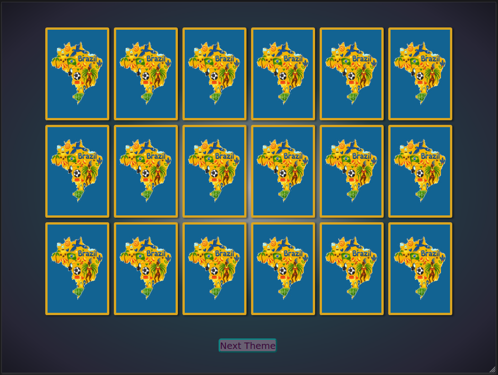

# Desafio de Projeto - TGI Bootcamp - DIO

## Jogo da Memória em HTML, CSS & JavaScript

#### Modificações do exemplo dado em aula:
    - Reconstrução completa do código [js]
    - Feature: Aumento do numero de cartas jogáveis de 6 para 9 pares [js, css, html]
    - Feature: Temas e botão para mudar de tema [js, css, html]
    - Feature: Tela de vitória com contagem de erros [js]
    - Animações de abertura, background e hover das cartas [css]
    - QoL: Remoção de dragging das cartas [html]

### Uso:
- [ABRA O JOGO AGORA MESMO](https://surtarso.github.io/javaScript-Projects/Desafio%20de%20Projeto%20-%20Jogo%20da%20Memoria/), ou:
- Clone o repositório ou baixe o .zip
- Abra o index.html no seu navegador.

#### Para adicionar novos temas:
- Baixe as imagens desejadas, sendo elas 9 imagens frente + 1 imagem verso
- Coloque as imagens em uma pasta "img-nometema" dentro da pasta assets (assets/img-nometema/)
- (opcional 1a) Renomeie o arquivo de verso para ser o primeiro da lista (ex. 0.jpg)
- (opcional 1b) Dentro da pasta do tema rode o comando: convert -resize 138x203 -strip ./* card.jpg
- Renomeie o arquivo com o verso para box.jpg e card1.jpg...card9.jpg para as frentes
- Abra assets/js/scripts.js e adicione o nome dado na array "temas" (temas = ['img', 'img-nometema', 'img-etc'])
- Jogue com seu novo tema! =)
